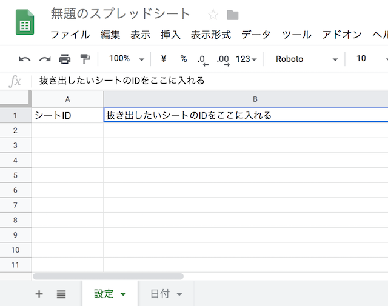
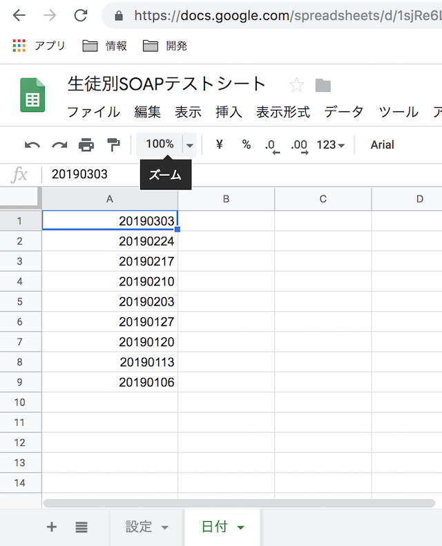
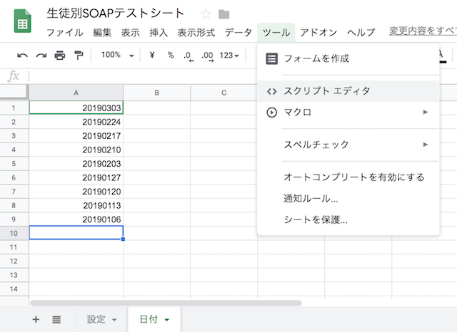
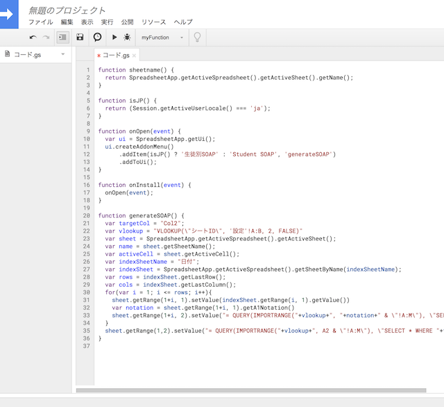
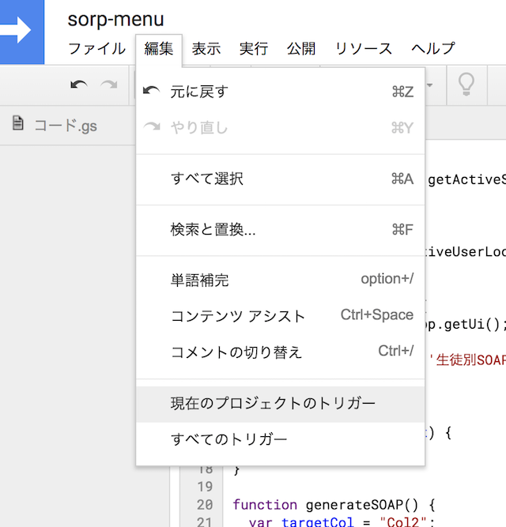
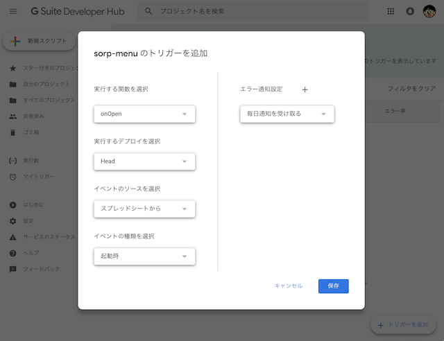
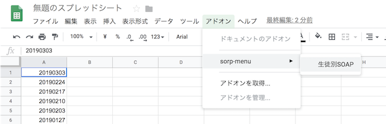
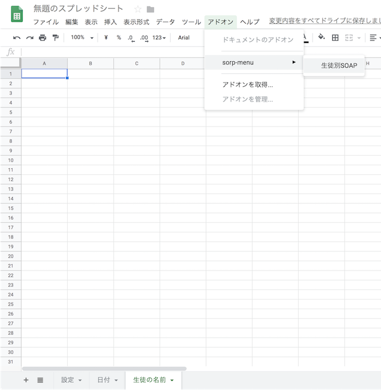

# 他のスプレッドシートから特定のデータを抜き出すサンプル

## 使い方

1) 新しくスプレッドシートを作成します。

2) 作ったスプレッドシートに設定と日付のシートを追加します。

3) 設定のシートに対象となるスプレッドシートIDを記入します。

  

4) 日付のシートに抜き出したいシートのシート名を記入します。

  

5) スクリプトエディタから sorp-menu.gs のスクリプトをコピペして入れ替えます。

  

  

6) 保存して現在のプロジェクトのトリガーを選択します。
例では sorp-menu という名前で保存しています。

  

7) 次のような設定で保存します。
実行する関数は onOpen にします。

  

8) スプレッドシートに戻り、ページをリロードすると、sorp-menu というメニューが現れます。

  

9) 抜き出す対象のシートの２列目の値をシート名にして、生徒別SOAPを実行します。

  

